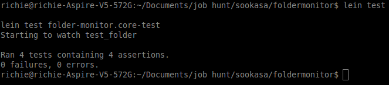
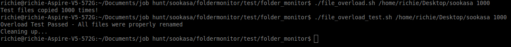

# folder-monitor

Folder-monitor is a simple program, written in [Clojure](http://clojure.org/) (a modern dialect of LISP), that monitors a specified folder for files whose name match a certain pattern, and renames them appropriately.

**NOTE:** folder-monitor requires at least version 7 of the Java Runtime Environement. You can check which version is currently running on your machine by executing `java -version` in the command line. Anything above 1.7 will work properly.

## Installation

The Clojure languages runs ontop of the JVM. As long as the host machine has Java installed, simply execute the jar file from the command line. All of folder-monitor's dependicies are pre-packaged inside of the jar file.

## Usage

Folder-monitor is packaged as jar file with all of its dependencies included. It accepts only one command line argument: the path of the Sookasa folder.

`$ java -jar folder-monitor-0.1.0-standalone.jar <path to sookasa folder>`

The jar file is already pre-built in the repository. You can find it by navigating to target/uberjar.

This command works on Linux, OSX, and Windows (as long as the java PATH environment variable is configured properly).

**Note:** On Windows, make sure that the "view file extensions" settings is enabled in the file viewer, otherwise it may be difficult to determine if the program is working as intended.

### Examples

`$ java -jar folder-monitor-0.1.0-standalone.jar /home/richie/Desktop/sookasa`

## Design Decisions

I chose not to use polling because I was worried that if the user was storing a large number of files, indexing the files on a regular basis would quickly become a bottleneck. The file-system events approach avoids this issue because files are only changed when they are added to the folder, or any kind of modification happens to a file that is already inside the folder.

The downside of the file-system event approach is that it doesn't affect files that are already improperly named in the folder. Only files that are added or modified are checked. However, this problem could easily be solved by performing a single index of all the files in the folder when the program starts, and then using filesystem events for all subsequent actions.

Once I had settled upon using filesystem-events, the next question became which library should I use to monitor filesystem events cross-platform. This turned out to be much harder than I anticipated. While there are tons of libraries out there for that purpose, I had two specific criteria I was looking for:

1. Works well cross-platform
2. Really fast

I wrote test scripts in Bash and PowerShell that allowed me to copy test files into a target directory 100's to 1000's of times, and then check to see if any of them failed to be renamed (using a simple regex). Using these scripts, I tested several different filesystem event monitoring libraries, including: Gaze, Filesystem WatchService (Java 7), Node native fs.watch, watchdog, etc. The libraries that I tested were all written in either Clojure / Java, Python, or JavaScript. As a result, I actually ended up implementing naive versions of the application in Clojure, Python, and Javascript respectively. Ultimately I settled upon Clojure as my final choice for reasons that I explain below.

While it definitely has its issues, the Java 7 Filesystem WatchService seemed to be the most performant and stable accross platforms. The only issue was that it doesn't have support for native filesystem events in OSX, but instead falls back on interval polling. The generally accepted way of solving this problem in the Java community is to use a library called Barbary WatchService which is able to tap into the OSX native filesystem events.

Since I wrote the final application in Clojure, I used a library called Hawk. Hawk provides two things that made it a good choice for this application:

1. On Linux and Windows, it simply providers a Clojure wrapper around the Java 7 Filesystem WatchService
2. On OSX, it uses the Barbary WatchService instead

Thus, by using Clojure in combination with Hawk, I was able to get all the benefits of Java's cross-platform capabilities, native filesystem events on Linux, OSX, and Windows, as well as the benefits of using a functionally-oriented language like Clojure.

### Clojure Language

I chose to write folder-monitor in Clojure for a few reasons. First, since Clojure is primarily a functional programming language, it lends itself better to solving asynchronous, event-based problems than the other languages I considered like Python and Java. I also thought that Clojure, being a primarily functional programming language, lended itself better to solving this type of asynchronous, event-based problem than other languages I considered like Python and Java. I thought that a combination of JavaScript / Node.js might also be a good fit as JavaScript is also a great language for functional programming and node was built from the ground-up with asynchronous IO in mind, however, Node's filesystem-event monitoring capabilities just weren't robust enough, even with industry-standard libraries like Gaze. 

Second, I didn't want to have to write platform-specific code for interacting with the filesystem and listening for events. Since Clojure runs on the Java Virtual Machine, I was able to use the Java WatchService API which was the most robust of the libraries that I tested. As a result, I was able to use (with a small library that basically serves as a Clojure wrapper around the Java WatchService and Barbary WatchService) the same code for Linux, OSX, and Windows, despite the fact that they each have different filesystem APIs.

## Testing

### Testing Decisions

I took a two-pronged approach to testing for the folder-monitor application. 

#### Unit Tests

I wrote a few simple unit tests that verify that each Clojure function is doing what its supposed to, including the regular expressions. These tests are written in Clojure and can be executed using Leiningen as described below.

#### Stress Tests
 
I wanted to stress test the application and make sure that it would handle large numbers of files being added to the monitored folder at once. I decided to implement these tests using Bash / PowerShell scripts because I was testing several different libraries in different languages, and I wanted the tests to be language/technology independent.

The bash script [file_overload.sh](test/test_files/file_overload.sh) copies three test files (an image, a word document, and a video) into the monitored folder X number of times in rapid succession. This script also creates a folder inside the monitored folder, and then copies the test files into that folder X times as well. This makes sure that the application can properly detect a new folder being created, and add it to the list of folders that are being watched (most filesystem event libraries do not provide this feature out of the box so I take care of it at an application level).

The companion script [file_overload_test.sh](test/test_files/file_overload.sh) checks to see if all the files were properly renamed, prints a test success/failure result, and then removes the test files from the folder.

The two bash scripts above work for Linux and OSX. For windows, I wrote a simple PowerShell script that does the same thing that file_overload.sh does, but I did not write an equivalent to file_overload_test in PowerShell. After the files have been copied into the folder in Windows using the PowerShell script, the renaming has to be verified manually by introspection.

### Running Tests

#### Unit Tests

1. Install [Leiningen](http://leiningen.org/)
2. Clone this github repository
3. Navigate to the local repository on your machine in the CLI
4. Execute `lein test`

#### Stress Tests

##### Linux / OSX

1. Make sure folder-monitor application is running
2. Navigate to test/folder_monitor within the file structure
3. Make the two files "file_overload.sh" and "file_overload_test.sh" executable by running the following commands in the terminal: `chmod +x file_overload.sh` and `chmod +x file_overload_test.sh`
4. Execute the file_overload.sh script with two command line arguments. The first should be the absolute path to the monitored folder. The second should be the number of times the test file gets copied into the Sookasa folder.
5. Once the files have been copied, execute the file_overload_test.sh script with the exact same command line arguments used in the step above.

**Example**: 

`./file_overload.sh /home/richie/Desktop/sookasa 100`

`./file_overload_test.sh /home/richie/Desktop/sookasa 100`

##### Windows

1. Make sure that PowerShell has permission to execute PowerShell scripts
2. Navigate to test/folder_monitor within the file structure
3. Execute the file_overload.ps1 script with two command line arguments. The first should be the absolute path to the monitored folder. The second should be the number of times the test file gets copied into the Sookasa folder.

**Example**

`./file_overload.ps1 c:\Users\richie\Desktop\sookasa 100`

## Development

If you want to develop the folder-monitor program further, the easiest way is to install and use [Leiningen](http://leiningen.org/). With Leiningen installed, changing the source code is easy:

1. Clone this repo
2. Make any modifications that you like to core.clj
3. Inside the project directory, execute `lein run <options>` to compile and run the program
4. Inside the project directory, execute `lein uberjar` to create an executable jar file that can be distributed to others

Leiningen handles dependency management and packaging for you.

## Potential Improvements

### Discrepancies Between Filesystems

Even though the Hawk library presents a seamless interface for monitoring filesystem events, regardless of the operating system, there are still some discrepancies that need to be managed. For example, in OSX and Linux copying a file into a folder triggers a single "create event". In Windows, on the otherhand, that same operation triggers a "create" event, and multiple "modify" events.

This has obvious performance implications (in fact, the application is noticeably slower when running on windows as opposed to Unix operatings ystem), but also subtler ones as well. For example, I originally implemented a logger functionality that kept track of all the events, however, this became an issue when running on windows as the same event would get logged many times.

I can think of two straightforward ways to address this problem:

1. Write operating system specific implementations, or incorporate operating system-specific code into the application itself

2. Implement a message queue where once an event is observed, its added to a set. Duplicate events in a set are not allowed, and events are only processed after a delay. This would be relatively straightforward to implement in Clojure as it has great support for concurrency. This would improve performance on all platforms by preventing the processing of duplicate events and allowing the message queue to be depleted by multiple threads.

### Index Folder on Startup

Perform a single check of every file in the monitored folder on program start so that files that are improperly named and are already present in the folder are renamed, not just files that are added/changed after the program has started running. This would be pretty trivial to add as a feature, 90% of the needed functionality is already written; it would simply be a matter of getting a list of all files currently in the directory when the application starts, but I decided not to include it because I wasn't sure if it really fit with the purpose of this program. That being said, I left some comments in the code on how that feature could be implemented if it became necessary.

### Regular Expressions

Improve the robustness of the regular expressions used to identify improperly named folders. I would also recommend a lot more tests surrounding this particular feature. The regular expressions used throughout folder-monitor are the "bare minimum" to get it working and could be made much more robust.

### Cleaning Up Event Listeners

Event listeners are not automatically removed for folders that are deleted. I didn't investigate the performance implications of this too thoroughly, but it would be something to keep in mind moving forward.